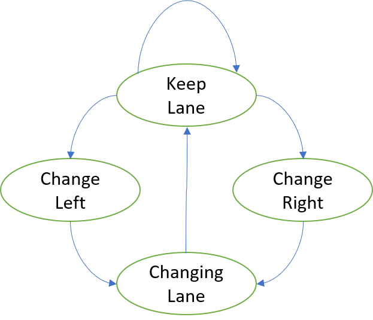
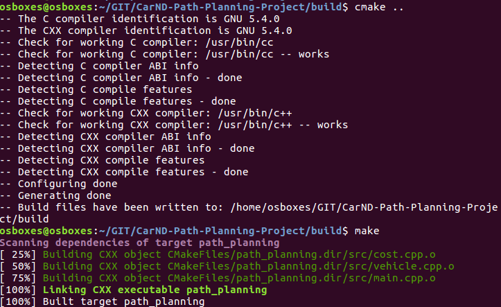
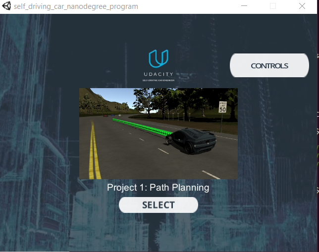
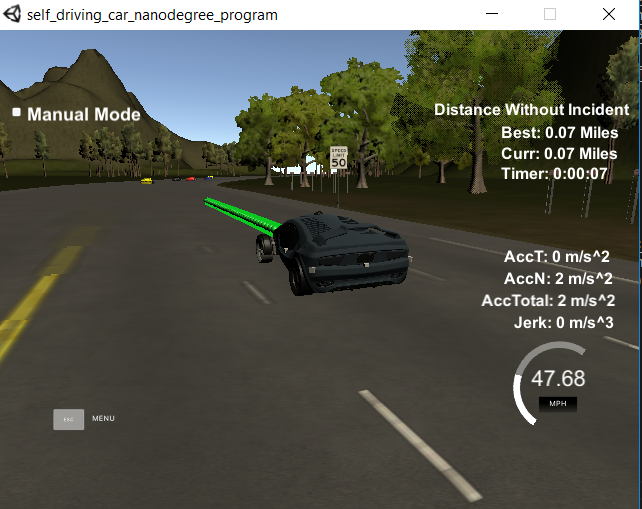
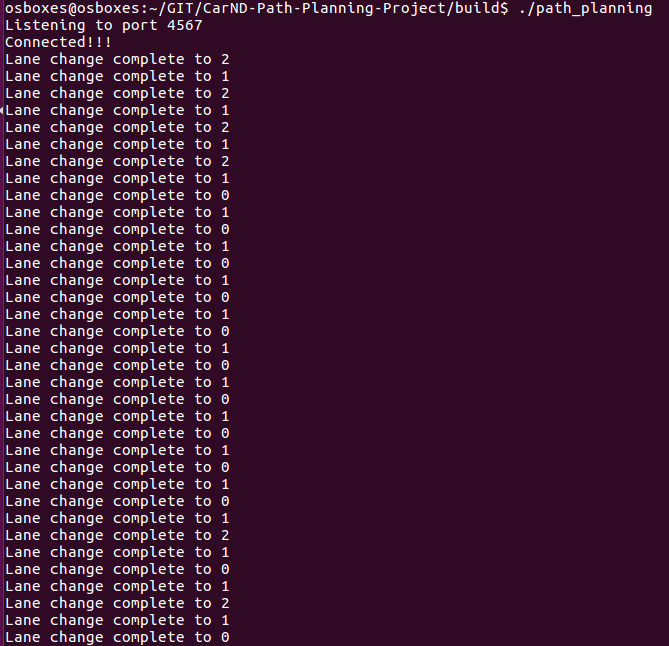
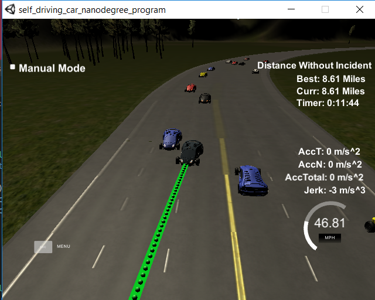
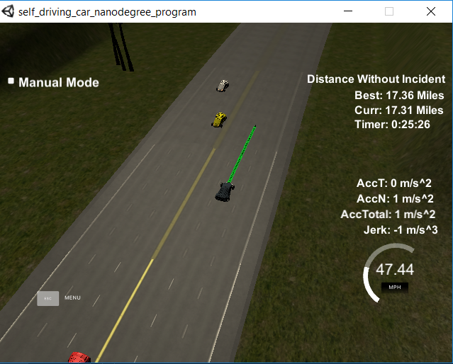
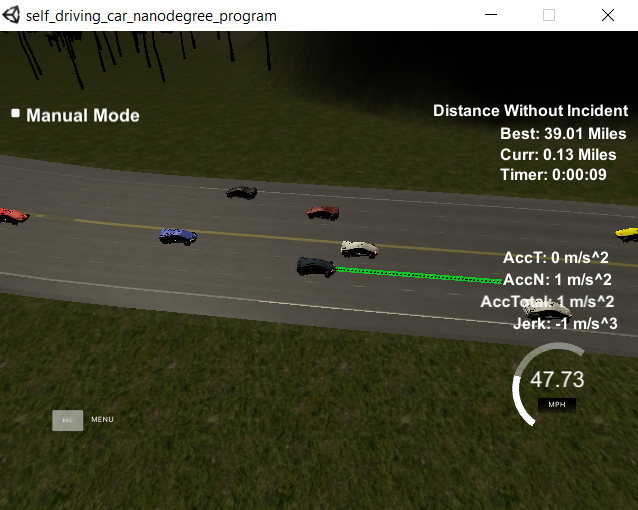

This is a project in Udacity Nanodegree for Self-driving car, forked from [CarND-Path-Planning-Projec](https://github.com/udacity/CarND-Path-Planning-Project).

# Path planning
The goal of this project is to implement a path planner that with help of sensor inputs can find a collision free way forward in a highway in a trafic simulator. This has been achieved in the following way:

1. A class vehicle, has been defined that wraps functions related to the vehicle [./src/vehicle.cpp](./src/vehicle.cpp). This class, in addition to collecting data necessary for control of the vehicle, implements four important functions:

    a. update(...) is to be called every step to update the data with the fresh ones. Lines 59-73 [./src/vehicle.cpp](./src/vehicle.cpp).

    b. cruise_control() drives the vehicle at a constant speed, set to 95% of maximum allowed speed, i.e. 50 MPH, if there are no obstacles on the path and otherwise, adjusts the speed to the front car. Lines 75-95 [./src/vehicle.cpp](./src/vehicle.cpp).

    c. successor_states() implements the state machine and for each state of the vehicle returns next possible stated. Lines 97-124 [./src/vehicle.cpp](./src/vehicle.cpp).

    d. set_next_state() goes through all possible states, calculates the cost for each of them and selects the one with lowest cost as next step. Lines 126-170 [./src/vehicle.cpp](./src/vehicle.cpp).

2. [./src/cost.cpp](./src/cost.cpp) implements the cost functions a function that calls all of them and calculates the total cost. Four different costs are considered:

    a. lane_cost() sets the cost to 0 for lane 1 and to 1 otherwise, meaning the middle lane is the prefered one. Lines 14-20 [./src/cost.cpp](./src/cost.cpp).

    b. right_passage_cost() makes it more favorable to pass the car in the front from the left side by adding a cost contribution if there is a car to be passed from right. Lines 22-30 [./src/cost.cpp](./src/cost.cpp).

    c. inefficiency_cost() penalizes a driving at a speed lower that the maximum allowed speed. A fourth degree polynomial is used to push the system to choose a path with higher speed. Lines 32-41 [./src/cost.cpp](./src/cost.cpp).

    d. collision_cost() eliminates risks of collision through pnalizing the states where the car is driving to places that are occupied by other costs. Lines 44-58 [./src/cost.cpp](./src/cost.cpp).

    Finally, these costs are weighted by 0.5, 4.0, 0.25, 10.0, respectively. Lines 67-74 [./src/cost.cpp](./src/cost.cpp).

3. src/main.cpp was first completed following the instructions given in the video and then modified as follows:

    a. According to the instructions, the path planner was adding points in the list after the points that were remaining from previous planning. This made the reaction slower that could be adjusted for by less changes and less aggressive driving. There was also an impact on the braking distance. As a simple adjustment, I decided to replan the path by keeping two points only. The position of the car was set to the second point in the list and yaw was calculated by using the tangent to the line between the last two points. Lines 141-155 [./src/main.cpp](./src/main.cpp).

    b. The sensor data is used to identify the closest cars in each lane. The information is collected and stored in two vectors that are later sent to the vehicle object by the function update. Lines 168-210 [./src/main.cpp](./src/main.cpp).

    c. After that the values are updated, the new lane is chosen by a call to set_next_lane() of vehicle. Line 212 [./src/main.cpp](./src/main.cpp).

    d. I used a different method for path discretization. I have both x and y as function of s and then, I choose delta values of s by multiplying the speed and the time difference between two points (0.02 seconds). The spline function can then be used to find corresponding x and y values. Lines 222-300 [./src/main.cpp](./src/main.cpp).

    e. The speed reduction and acceleration is made by the cruise_control funtion of the vehicle object. Line 313 [./src/main.cpp](./src/main.cpp).

4. CMakeLists.txt is modified so that Vehicle class and cost functions can be compiled and linked with the other object files.

To simplify the problem, the cruise function and steering are decoupled. The cruise function keeps the speed as high as possible without hitting the car in the front. The steering, follows a state machine as shown below:

The car driving in a lane, evaluates 3 options: continue to keep the lane, change to left or change to right. The option with lowest cost is selected. If the selected option is not keeping the lane, then the car target lane will be set to the selected one and the car goes to the changing lane state. The car stays in that state until it comes close to the center of the lane. At that time, it changes the state to keep lane and continues to evaluate the possibilities. In this simple state machine, once a decision is taken to change the lane, the change must be completed before new options are evaluated.

# Build, compilation and installation on Ubuntu
After cloning the repository, create a new directory with the name build, change the directory to build and run `cmake` as shown below:

`mkdir build`

`cd build`

`cmake ..`

This will create a make file that can be used to compile and link the program using `make`. For that, while being in build directory, simply run:

`make`

Running `make` will compile the c++ files and try to link them. Assuming that all dependencies described in [Udacity's project repository](https://github.com/udacity/CarND-Path-Planning-Project) are satisfied, and especially [micro WebSockets](https://github.com/uNetworking/uWebSockets) is installed, make will produce an executable file called `path_planning`. If you do not have [micro WebSockets](https://github.com/uNetworking/uWebSockets) installed, please follow [Udacity's instructions](https://classroom.udacity.com/nanodegrees/nd013/parts/168c60f1-cc92-450a-a91b-e427c326e6a7/modules/1c4c9856-381c-41b8-bc40-2c2fd729d84e/lessons/3feb3671-6252-4c25-adf0-e963af4d9d4a/concepts/7dedf53a-324a-4998-aaf4-e30a3f2cef1d) to have it properly installed.

Note that in my case, the code was compiled with GNU compiler 5.4.0. Minor differences, especially with Visual c++ might exist.

# Running the planner
Running the controller requires connection with [Udacity's simulator](https://github.com/udacity/self-driving-car-sim/releases). I had my simulator on Windows and the controller on Ubuntu running on [VirtualBox](https://www.virtualbox.org/wiki/Downloads).

First, start the simulator and wait: 

Then, start the path planner. The path planner starts and listens to port 4567 for connection: 

Finally, pushing the button 'select' starts the simultion:

Once the simulation is started, the path planner outputs every time the car changes the lane as below. Roughly, we could see one or two lane changes per minute.

# Results
My car was driving at a maximum speed set to 95% of allowed speed, i.e. it could go maximum up to 47.5 mph. The data shown in the below fgures indicate an average speed of about 42 mph, which I find as reasonable. 

The above path planner is able to drice the car much longer than 4.3 miles. In most of the cases, I stopped the simulation at around 10 miles.

However, I noticed that the driving time cannot be infinit. The picture below shows that the car has gone two times a distance of about 17 miles, with an incident between that, unfortunately, I could not capture. I had difficulties to identify why the counter was restarted. I could see a number of 'bad drivers', but never that they would cause an accident. In one case, I noticed that the car was too close to the middle lane line and passed it, leading to restarting the counter. It could be so that the waypoints are not dense enough and therefore not accurate enough.

The longest distance the car reached before having an accident was 39 miles. Unfortunately, I captured it just after the resetting and could not see the incident.

# Reflections

I summarize my learnings and reflections as follows:

* The separation of the cruise function and the steering led to a strong simplification. In a more realistic model, acceleration and deceleration could be sub-states of the state machine above.

* Modeling the behavior as a state machine is powerful for implementing well-controlled driving characteristics. My state machine was a simple one, apparently good enough for the present case. However, in reality, such model can become very complex. I would expect that each state will in-turn need to be modelled with sub-states with internal transitions.

* Likewise, the cost functions allow decisions to be taken considering many different factors at the same time. The complexity comes in as we have many parameters that need to be tuned to achieve a sound decision making capacity.

* For real-world application, we also need a kind of emergency control algorithm, such that accidents can be avoided by breaking some of the rules. For example, passing lane lines would be an acceptable action if it can avoid a collision.

* I could see that my car paid attention to others and follwed rules, while the others could act less thoughtfully. In a future society, when all control characteristics are controlled and defined, driving cars will be much safer.